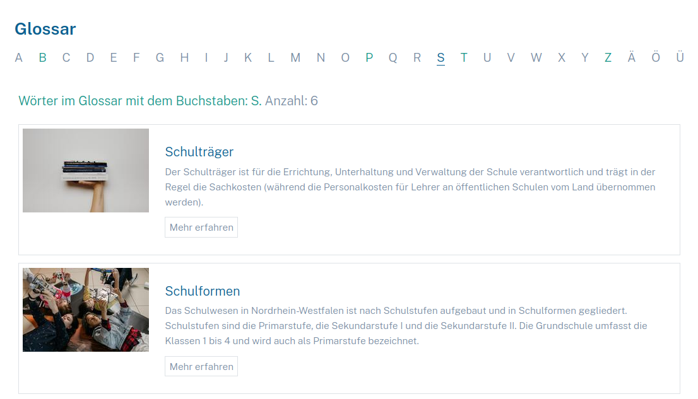

Trollfjord GlossaryBundle
========================================

### Description:

It is a program to manage a glossary, and covers the backend and frontend areas:
<details>
<summary markdown="span">1. <b>Backend</b>: it is used to insert and manage the words of the glossary, it is the part used by the administrator.</summary>


</details>
<br>
<details>
<summary markdown="span">2. <b>Frontend</b>: it is in charge of displaying the glossary content.  The page that manages all the words in the glossary with public access has the function of organizing the words in their respective letters of the alphabet; when a word is found in the content of a page (which was stored in the glossary), a link is inserted so that the user can access the content of this word.</summary>

#### Glossary page:




#### Word replacement:

1. Desktop view:<br>
   <br>
   
   <br>
   <br>
2. Mobile view:<br>
   <br>

![alt text][mobile]

[mobile]: ./Z_img/mobile.png "Dashboard"
   </details>

### Usage:
In order to match the words in the public area of the website, a snippet must be selected and the desired content must be surrounded by the tags:
 <br><br>`<!--glossary-start-->`
content 
`<!--glossary-end-->`
<br>
<br>
for example:

```
<p class="ptext px-grid px-md-0">
<!--glossary-start-->
<rs:textarea id="Text" label="Text" />
<!--glossary-end-->
</p>
```

### Configuration:

This bundle has the following configurations:
<details>
<summary markdown="span">1. regex_template:</summary> 

This is the template that is responsible for displaying the word in the frontend. 
When a word is found in text, that is saved in the table Glossary, it will be displayed using this template. It is displayed in the form of a link. The default current template is: <br>
'glossary-link-simple.html.twig'.
<br>
This is a simple HTML link. But there is a template that has a Vue component, and it is ready to go(see the pictures above under Frontend->Word replacement) and the name is:
'glossary-link.html.twig'. It comes with other components that have to be used: store/glosstore.ts and GlossaryLink.vue.
It has all the functionality to display the contents on the same page where the word is exchanged, it is also responsive for mobile devices, and it only renders the word content when the user clicks the link. <br>
The template variables are:
1. **wordDisplayed**: it is the word that comes from the original content.
2. **isRelatedWord**: bool, ask if is a word that is child from a word saved in the Glossary table.
3. **word**: it comes from the database.
4. **wordId**: it comes from the database.
5. **slug**: it comes from the database.
6. **image**: id of the image, it comes from the database.
7. **href**: fixed url ready to use.
</details>
<br>
<details>
<summary markdown="span">2. index_template: </summary>

   This configuration is used to exchange the template that is in charge of displaying the Glossary content in the frontend. There are the following variables that can be present in the template(depending of the request):             

1. **letters**: <br>contains the letters of the alphabet and is an array in which each element has the following values:
    1. **key**: <br> This is the letter id, and it is storage in the Glossary table under the variable: **letterGroup**
    2. **value**: <br> This contains the letter changed if this is a german letter.
    3. **display**: <br> Is the letter displayed on the page, and can contain german letters such as: Ä, Ü, Ö
    4. **numberOfWords**: <br> Number of words under this letter stored in the Glossary table


2. **listOfWords**: <br>It is optimized for pagination and is an array with the words found in the Glossary table under
   the letter and each entry contains:
   "id", "word" ,"slug", "relatedWords", "shortDescription", "definition", "image", "theme" and "letterGroup".


3. **word**:  This is the word found in the Glossary table.


4. **wordNotFound**: In case that a word is pass direct to the url, and it is not found.


5. **letterToShow**: Is the word displayed and has the following values:
    1. **valid**: it says if is a valid letter-> if it is in the german alphabet.
    2. **value**:  it stores the value passed in the URL
    3. **numberOfChars**: number of chars that the string contains('A', 'Ae','Oe'...)
    4. **rawValue**: letter that comes from the url


6. **previous**:  It is used for pagination, and uses a variable called 'offset' and performs a mathematical operation
   on it.


7. **next**: It is used for pagination, and uses a variable called 'offset' and performs a mathematical operation on it.

</details>
<br>
<details>
<summary markdown="span">3. service_regex:</summary>

This configuration assigns a service that takes care of the logic of the word exchange in the frontend text.
This service implements an interface: 'RegexServiceInterface.php' this interface receives the content which has all the snippets of a page.</details>

<br>
<details>
<summary markdown="span">4. items_per_page_front:</summary>

Number of items to be displayed in the word list in the frontend, used for the pagination.
Default: 5.
</details>

<br>
<details>
<summary markdown="span">5. items_per_page:</summary>

Number of items to be displayed in the word list in the backend, used for the table pagination.
Default: 5.
</details>


<br>
<br>